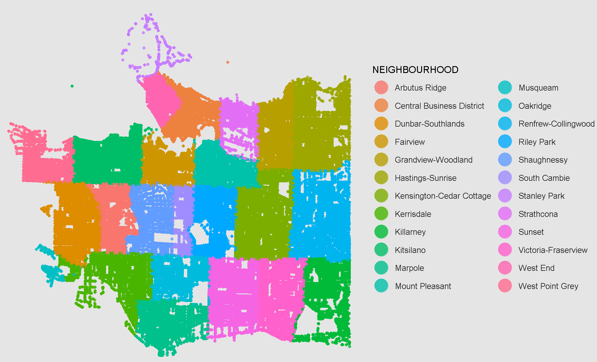
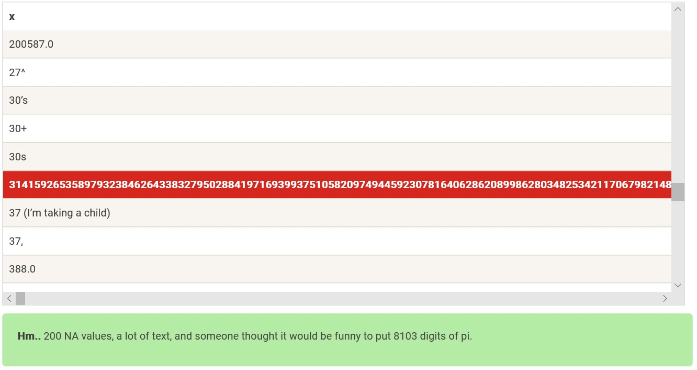

*corks often withered* 

### About me
>I recently graduated with a Bachelor of Science (B.Sc.) Major in Statistics at the University of Winnipeg, Manitoba. Statistical analysis is a passion of mine, I am always looking at the statistics to see their relative significance and learn more about the data. There are many topics I wish to explore further such as neural networks, machine learning, cluster analysis, Bayesian data analysis, and random forests to name a few. I am enthusiastic about learning, not only in data science and statistics, but in general. Recently I have been learning more:

>>* R (programming language)
>>* SAS
>>* SQL 
>>* HTML 
>>* Markdown
>>* Python

>The communities my folk ensembles are a part of are important to me, I try to be as involved as much as possible volunteering in various fundraisers and festivals. I've been dancing with these groups for over ten years and look forward to Folklorama each summer. I have trained Krav Maga for about three years and have completed a few exams. My interest in soccer picked up, so I joined a couple soccer leagues and created a shop for one of my teams. I also take part in the Winnipeg Data Science Meet-Ups, and I am a part of the Winnipeg R User Group.

### Projects
*Though I may not have everything posted here, I wanted an easier way than going through github repositories to to find pdfs.*
#### Crime in Vancouver

* **[Crime Statistics Report](https://davidrucinski.github.io/Crime-in-Vancouver/crime_in_Van.html)**
>* [Data Profile](https://davidrucinski.github.io/Crime-in-Vancouver/data_profile_report.html)
>* [Vancouver Open Data Catalogue (all years)](https://data.vancouver.ca/datacatalogue/crime-data.htm)

#### Angina & Heart Disease
* **[Modeling and graphics showcase](https://davidrucinski.github.io/Heart_health/show_heart.html)**
>>* [Repository](https://github.com/DavidRucinski/Heart_health)

#### Personal Website
>>* [Repository](https://github.com/DavidRucinski/davidrucinski.github.io)

#### Candy-Cleaning

>* **[Candy Clean-up](https://davidrucinski.github.io/Heart_health/Candy/CandyFile.html)**
>>* [Repository](https://github.com/DavidRucinski/Heart_health/tree/master/Candy)

#### Winnipeg Project
>>* [Repository](https://github.com/DavidRucinski/Winnipeg)

#### Sentiment Analysis on Lyrics
>* [Lyric-Analysis](https://github.com/DavidRucinski/Lyrics/blob/master/lyrics_mining.pdf)
>>* [Repository](https://github.com/DavidRucinski/Lyrics)

#### Unemployment Rates in Canada
>* [Unemployment Rate (Time series analysis)](https://github.com/DavidRucinski/CanadianUnemployment/blob/master/Project_unemployment.pdf)
>>* [Repository](https://github.com/DavidRucinski/CanadianUnemployment)

#### Assignments
*Some coursework that required R.*
>* [Multivariate Assignment #4](https://github.com/DavidRucinski/Assignments/blob/master/multivar_As4.pdf)
>* [Multivariate Assignment #5](https://github.com/DavidRucinski/Assignments/blob/master/multi_as5.pdf)
>* [Biostatistics Assignment #5](https://github.com/DavidRucinski/Assignments/blob/master/as_5_biostat.pdf)
>* [Time Series Assignment #3](https://github.com/DavidRucinski/Assignments/blob/master/TimeSeriesAs3.pdf)
>>* [Repository](https://github.com/DavidRucinski/Assignments)

##### Certifications

- [Data Scientist with R Track - Career Track](https://www.datacamp.com/statement-of-accomplishment/track/c027005be6f3c13c139be3d1436a3f8328b21382){:target="_blank"}
>>* **DataCamp**
>>* Credential ID: c027005be6f3c13c139be3d1436a3f8328b21382
>>* September 2019

- [SQL Fundamentals - Skill Track](https://www.datacamp.com/statement-of-accomplishment/track/a2796832ec1bc72e51a72e8045c7172d7c767289){:target="_blank"}
>>* **DataCamp**
>>* Credential ID: a2796832ec1bc72e51a72e8045c7172d7c767289
>>* August 2019

- [Data Analyst with R - Career Track](https://www.datacamp.com/statement-of-accomplishment/track/d3742cbe66bb54e8f508e04cd5946c6d6b23ebe3){:target="_blank"}
>>* **DataCamp**
>>* Credential ID: d3742cbe66bb54e8f508e04cd5946c6d6b23ebe3
>>* June 2019

- [Machine Learning](https://www.coursera.org/account/accomplishments/verify/XMS2R3WAZHZ2){:target="_blank"}
>>* **Coursera**
>>* Credential ID: XMS2R3WAZHZ2
>>* May 2019

##### Links
- [Iskry](http://www.iskry.com/){:target="_blank"}
- [Kapisztran](https://en-gb.facebook.com/kapisztranensemble/){:target="_blank"}
- [Krav Maga](http://kravmaga-winnipeg.ca/?page_id=15){:target="_blank"}
- [Casuals FC Store](https://casualsfc.entripyshops.com/){:target="_blank"}
- [Learn some R/SQL/Python with DataCamp](https://www.datacamp.com/promo/special_discount?friend_code=MjI3MTc2Mw%3D%3D){:target="_blank"}

Why [MS Excel/Spreadsheets](http://panko.shidler.hawaii.edu/SSR/Mypapers/whatknow.htm){:target="_blank"} are not always the best option, yes in some cases this tool should be used but not for everything.
